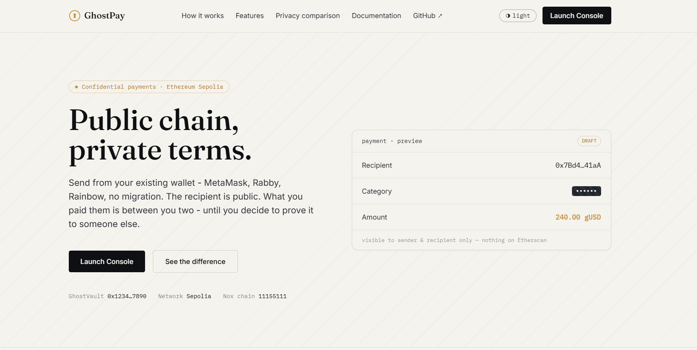
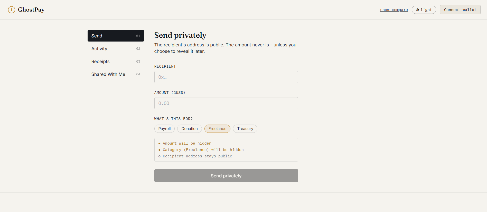
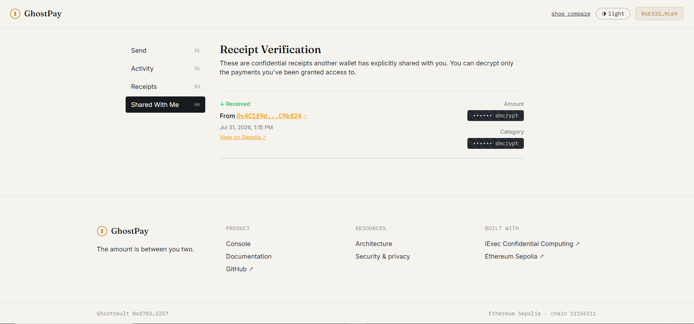

<h1 align="center">GhostPay</h1>

<p align="center">
Private Payments on Public Rails
</p>

<p align="center">
GhostPay enables confidential payments and selective receipt sharing on Ethereum using <strong>iExec Nox</strong>, while remaining compatible with existing wallets like MetaMask, Rabby, and Rainbow.
</p>

<p align="center">


</p>

---

# The Problem

Public blockchains provide transparency, but not privacy.

Whenever a payment is made on-chain, anyone can inspect:

- who paid
- who received
- how much was transferred
- what the transaction represents

For many real-world use cases, this is undesirable.

Examples include:

- payroll payments
- freelancer settlements
- treasury operations
- charitable donations

Although these transactions should settle on a public blockchain, the payment amount and business context should remain confidential.

Current public ERC-20 transfers expose all of this information forever.

---

# The Solution

GhostPay introduces confidential payments without requiring users to migrate to a new wallet.

Users continue using wallets they already own, including:

- MetaMask
- Rabby
- Rainbow

GhostPay leverages **iExec Nox** to encrypt confidential payment information while still settling transactions on Ethereum Sepolia.

Unlike ordinary transfers, GhostPay encrypts:

- payment amount
- payment category

while allowing the recipient to receive funds normally.

The result is a familiar wallet experience with confidential transaction metadata.

---

# Why iExec Nox?

GhostPay is built on top of **iExec Nox confidential smart contracts.**

Nox provides encrypted computation and access control primitives that allow smart contracts to work with confidential values.

GhostPay uses these capabilities to:

- encrypt payment amounts
- encrypt payment categories
- grant decryption rights only to authorized wallets
- selectively disclose individual receipts without exposing an entire payment history

Instead of modifying ERC-20 tokens, GhostPay wraps an existing token through the official Nox confidential wrapper and adds confidential payment functionality on top.

---

# Features

| Feature | Description |
|----------|-------------|
| Confidential Payments | Payment amounts remain encrypted |
| Encrypted Categories | Payment purpose stays private |
| Selective Receipt Sharing | Share a single payment with another wallet |
| Existing Wallet Support | Works with MetaMask, Rabby and Rainbow |
| Public Settlement | Transactions still settle on Ethereum |
| Confidential Access Control | Powered by Nox ACL permissions |

---

# Architecture

<p align="center">

</p>

GhostPay consists of two primary smart contracts.

### GhostVault

Wraps an existing ERC-20 into a confidential ERC-7984-compatible asset using the official Nox wrapper.

### GhostPayRouter

Coordinates confidential payments by:

- encrypting payment amounts
- encrypting payment categories
- storing confidential payment records
- issuing selective receipts
- managing viewer permissions through Nox ACL

---

# Payment Flow

<p align="center">

</p>

A confidential payment follows five simple steps.

1. User connects an existing wallet.
2. Amount and category are encrypted locally.
3. GhostPayRouter stores confidential payment data.
4. Recipient receives the payment.
5. Sender may optionally share a confidential receipt with a third-party wallet.

Only wallets explicitly granted permission can decrypt shared receipt information.

---

# Landing Page

<p align="center">

</p>

GhostPay introduces users to confidential payments while maintaining the familiar Web3 wallet experience.

---

# Sending a Confidential Payment

<p align="center">

</p>

Users enter:

- recipient
- payment amount
- payment category

The amount and category are encrypted before being submitted to the blockchain.

---

# Shared Receipt Verification

<p align="center">

</p>

GhostPay introduces selective disclosure.

Instead of exposing an entire payment history, a sender can authorize another wallet to decrypt **only one specific payment receipt**.

Typical use cases include:

- accountants
- auditors
- employers
- compliance teams
- business partners

Every receipt is individually permissioned using Nox access control.

---

# Repository Structure

```
GhostPay
│
├── contracts/
│   ├── GhostVault.sol
│   ├── GhostPayRouter.sol
│   ├── MockUSD.sol
│   ├── scripts/
│   └── test/
│
├── frontend/
│   ├── src/
│   ├── public/
│   └── components/
│
├── docs/
│   ├── architecture.png
│   ├── payment-flow.png
│   ├── banner.png
│   └── screenshots/
│
├── feedback.md
└── README.md
```

---

# Technology Stack

| Layer | Technology |
|---------|------------|
| Blockchain | Ethereum Sepolia |
| Confidential Layer | iExec Nox |
| Smart Contracts | Solidity 0.8.28 |
| Frontend | React 19 |
| Language | TypeScript |
| Wallet Integration | Wagmi + RainbowKit |
| Build Tool | Vite |
| Styling | Tailwind CSS |

---

# Running Locally

## Clone

```bash
git clone https://github.com/YOUR_USERNAME/ghostpay.git

cd ghostpay
```

## Contracts

```bash
cd contracts

npm install

cp .env.example .env
```

Fill in:

```
SEPOLIA_RPC_URL=

DEPLOYER_PRIVATE_KEY=
```

Compile contracts

```bash
npm run compile
```

Deploy

```bash
npm run deploy:sepolia
```

Copy the deployed addresses into

```
frontend/src/lib/addresses.ts
```

---

## Frontend

```bash
cd frontend

npm install

npm run dev
```

Open

```
http://localhost:5173
```

---

# Smart Contracts

## GhostVault

Wraps an ERC-20 token into a confidential ERC-7984-compatible asset using the official Nox wrapper.

## GhostPayRouter

Responsible for:

- confidential payment creation
- encrypted category storage
- receipt issuance
- selective disclosure
- viewer permission management

---

# Future Improvements

- Complete confidential ERC-7984 transfer integration
- Multiple receipt viewers
- QR-based receipt sharing
- Mobile-responsive interface
- Mainnet deployment
- Confidential payment analytics

---

# Built For

**iExec Write The Future (WTF) Hackathon – Summer Edition**

Track

Confidential Smart Contracts with Nox

Built using

- iExec Nox
- Ethereum Sepolia
- Solidity
- React
- TypeScript

---

# License

MIT License.
